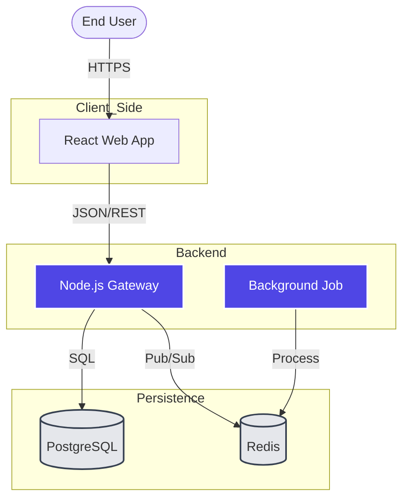

# Agentic Visual Architecture Standard (AVAS-v2)

## 1. Core Principles (Invariants)
*   **Visual Pattern Recognition:** Shift load from reading text to scanning shapes.
*   **Labeled Connections:** Every arrow `-->` MUST have a label (e.g., `|JSON|`). Unlabeled arrows are forbidden.
*   **Directionality:** Always use `graph TD` (Top-Down). Time/Data flows down.
*   **Truth:** The diagram MUST match `prodoc/relations.md`. Don't invent edges.

## 2. Workflow (Visual Thinking)
1.  **Detect Scope:**
    *   Whole System? -> **Container View (L2)**.
    *   Database? -> **ER Diagram (L3)**.
    *   Logic Flow? -> **Sequence Diagram**.
2.  **Scan Code:** Locate Entry Points (`App.tsx`), State (`schema.prisma`), and External Dependenices (`package.json`).
3.  **Group:** Use `subgraph` to cluster logical units (Client, Cloud, Database).
4.  **Style:** Apply standard class definitions for readability.

## 3. Visualization Levels
*   **Level 1 (Context):** User + System + External APIs.
*   **Level 2 (Container):** React + API + DB + Redis. (Ref: Docker Containers).
*   **Level 3 (Component):** Classes, Tables, Services.

## 4. Forbidden Patterns (Strict)
1.  **Spaghetti:** Connecting everything to everything. Use Grouping/Subgraphs to organize.
2.  **Ghost Nodes:** Including services that don't exist in `relations.md`.
3.  **Generic Shapes:** Failing to distinct `[Process]`, `[(Database)]`, and `{{External}}`.

## 5. Golden Example (The Ideal Container View)

