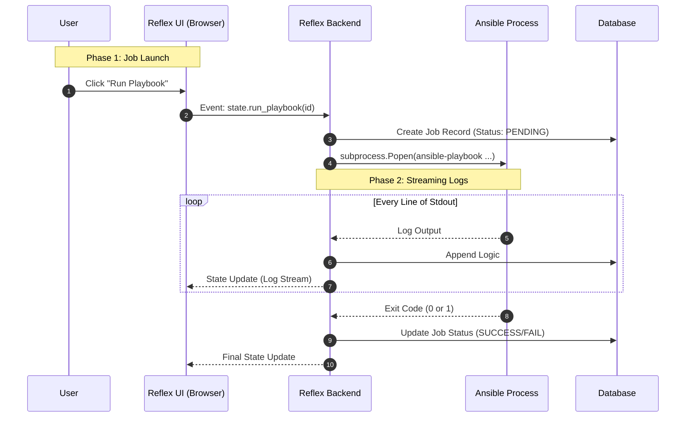

# **Project Specification: Reflex Ansible Manager**

Version: 1.0.0
Type: Python Web Application (Reflex Framework)

## **1. The North Star (Executive Summary)**

**Reflex Ansible Manager** is a modern, pure-Python web interface for managing Ansible inventories, playbooks, and job executions. It aims to replace complex, resource-heavy alternatives (like AWX/Tower) for small-to-medium teams with a lightweight, developer-friendly UI.

It strictly adheres to a "Python-Only" philosophy:
1.  **Frontend (Reflex):** The UI is written entirely in Python, which compiles to a React/Next.js frontend.
2.  **Backend (Reflex/Python):** Manages the Ansible subprocesses, inventory parsing (YAML/INI), and execution logs.

**Core Value Proposition:** A "Ops-in-a-Box" solution where a DevOps engineer can manage infrastructure without writing a single line of JavaScript.

## **2. Tech Stack & Constraints**

### **Application Structure (Reflex Standard)**
*   `reflex_ansible/`: Main application package
*   `reflex_ansible/pages/`: UI Pages (Dashboard, Inventory, Jobs)
*   `reflex_ansible/state/`: Event handlers and Application State
*   `reflex_ansible/components/`: Reusable UI components (Atomic Design)
*   `ansible_data/`: Directory for Inventory and Playbooks

### **Frontend (Reflex)**
*   **Framework:** Reflex (Latest)
*   **Styling:** Reflex Style Props (Tailwind-under-the-hood)
*   **Components:** Radix UI (Reflex default primitives)
*   **State Management:** Reflex State (Delta-based updates)

### **Backend (Logic & Automation)**
*   **Language:** Python 3.11+
*   **Automation Engine:** Ansible Core
*   **Task Queue:** Redis (optional) or Python `asyncio` subprocesses for job streaming.
*   **Database:** SQLAlchemy (Reflex built-in) with SQLite (Dev) / Postgres (Prod).

## **3. Architecture & Data Flow**

### **3.1 System Context**



## **4. Core Feature Specifications**

### **Feature A: Inventory Manager**
*   **Visuals:** Data Grid / Table view of Hosts.
*   **Capabilities:**
    *   Import from existing `hosts.ini` or `inventory.yaml`.
    *   CRUD operations on Hosts and Groups.
    *   "Ping" check (runs `ansible host -m ping`) with visual status indicator.

### **Feature B: Playbook Library**
*   **Editor:** Monaco Editor integrated into Reflex for YAML editing.
*   **Validation:** Syntax check (`ansible-playbook --syntax-check`) before saving.
*   **Organization:** Folder-based categorization.

### **Feature C: The "Console" (Job Runner)**
*   **Visuals:** Dark mode terminal aesthetic (xterm.js wrapper or simple scrollable div).
*   **Real-time:** Must stream output line-by-line using Reflex's `yield` or `background_task` features.
*   **History:** view past jobs, filtering by Success/Failure.

## **5. API Interface (Data Models)**

### **Host Model**
```python
class Host(rx.Model, table=True):
    hostname: str
    ip_address: str
    group: str
    last_ping_status: str  # "UP", "DOWN", "UNKNOWN"
```

### **Job Model**
```python
class Job(rx.Model, table=True):
    playbook_name: str
    status: str            # "RUNNING", "SUCCESS", "FAILED"
    start_time: datetime
    end_time: datetime
    log_output: str        # Text field for full log
```

## **6. Development Workflow**

1.  **Init:** `pip install reflex ansible`
2.  **Run:** `reflex run`
3.  **Ansible Env:** Ensure `ansible-playbook` is in the PATH.

## **7. Agent Context Integration**
This project requires strict adherence to the **Python Context Standard**.
-   **Security:** No hardcoded SSH keys (use SSH Agent or Vault).
-   **Testing:** `pytest` for backend logic, `playwright` for Reflex E2E.
