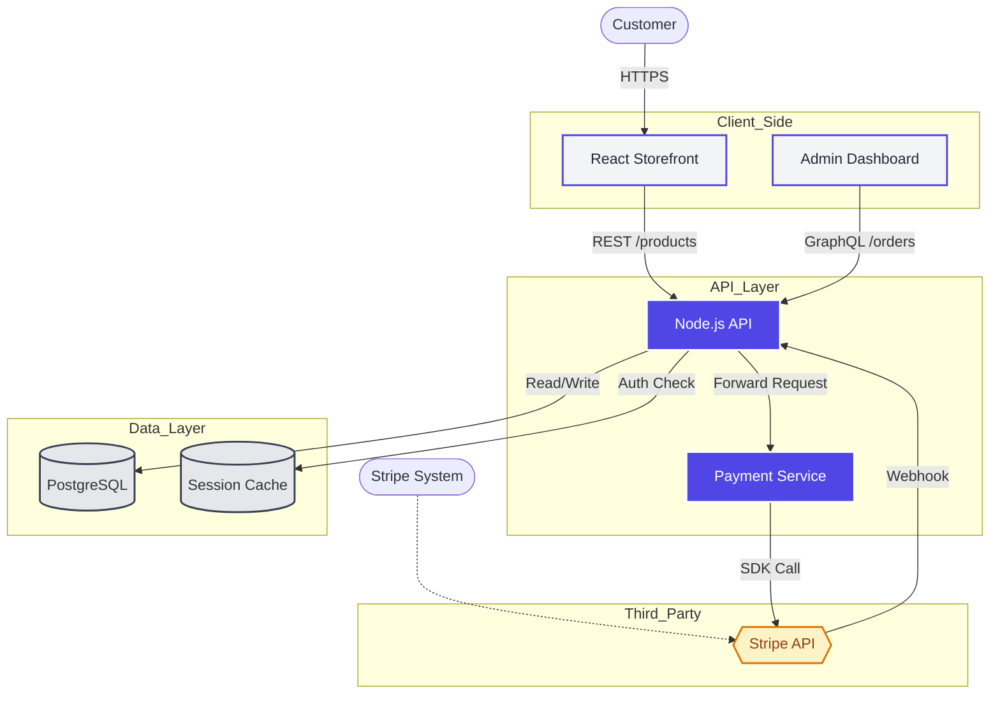

# AVAS Mock Demonstration Report

**Protocol Tested:** `DiagramFramework.md` (Agentic Visual Architecture Standard)
**Context:** React Standard
**Date:** 2026-01-03

---

## **Case 1: Static Deployment (No DB/API)**
**Scenario:** A user requests a diagram for a simple "Portfolio Site" built with React and Vite, hosted on Netlify. There is no backend, no database, and no external API calls.

### **Agent Simulation**
*   **Structural Scan:**
    *   `package.json`: Found `react`, `vite`. No `axios`, `prisma`, or backend.
    *   `App.tsx`: Hardcoded data.
*   **Selected View:** Level 1 (Context) / Level 2 (Container - merged for simplicity).

### **Generated Diagram**
"Based on the file structure, here is the architecture for the Static Portfolio:"

```mermaid
graph TD
    %% Actors
    User([Visitor])

    %% Grouping: Distribution
    subgraph CDN_Provider
        Netlify{{Netlify CDN}}
        Asset[Static Assets & JS]
    end

    %% Grouping: Client
    subgraph Browser
        App[React Portfolio App]
    end

    %% Connections
    User -->|HTTPS/Request| Netlify
    Netlify -->|Delivers Content| App
    User -->|Interacts| App
    App -.->|Routing (Client-Side)| App

    %% Style Definitions
    classDef primary fill:#4f46e5,stroke:#fff,stroke-width:2px,color:#fff;
    classDef secondary fill:#f3f4f6,stroke:#4f46e5,stroke-width:2px,color:#1f2937;
    classDef storage fill:#e5e7eb,stroke:#374151,stroke-width:2px;

    %% Apply Classes
    class Netlify primary;
    class App secondary;
```

### **Post-Diagram Analysis**
*   **Data Flow:** Unidirectional delivery; the user downloads the bundle, and all interaction happens locally in the browser.
*   **Risk Assessment:** None (Static site).

---

## **Case 2: Full-Stack E-Commerce (With DB & API)**
**Scenario:** A user requests a diagram for a "Shop App". The agent detects a Node.js backend, a PostgreSQL database, and Stripe integration.

### **Agent Simulation**
*   **Structural Scan:**
    *   `ProDoc/relations.md`: Maps `CheckoutFeature` -> `PaymentService`.
    *   `schema.prisma`: Exists (`Order`, `User`).
    *   `package.json`: `stripe`, `pg`, `express`.
*   **Selected View:** Level 2 (Container).

### **Generated Diagram**
"Based on the file structure and `relations.md`, here is the architecture:"



### **Post-Diagram Analysis**
*   **Data Flow:** User actions triggers API calls which read/write to Postgres; payments are offloaded to Stripe with async webhook updates.
*   **Risk Assessment:** Hard dependency on Stripe API availability for checkout flow.
