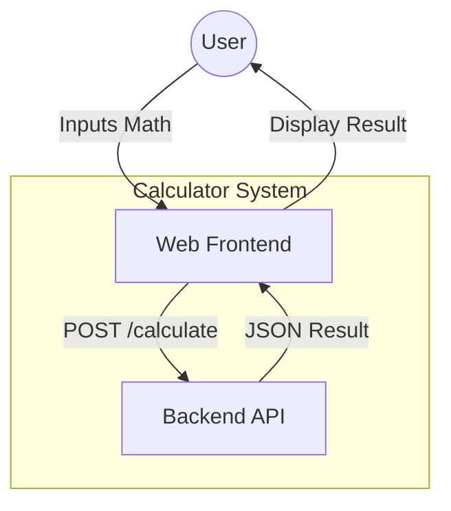

# System Context Diagram

```mermaid
graph TD
    User((User))
    subgraph "Calculator System"
        Frontend[Web Frontend]
        Backend[Backend API]
    end
    
    User -->|Inputs Math| Frontend
    Frontend -->|POST /calculate| Backend
    Backend -->|JSON Result| Frontend
    Frontend -->|Display Result| User
```
