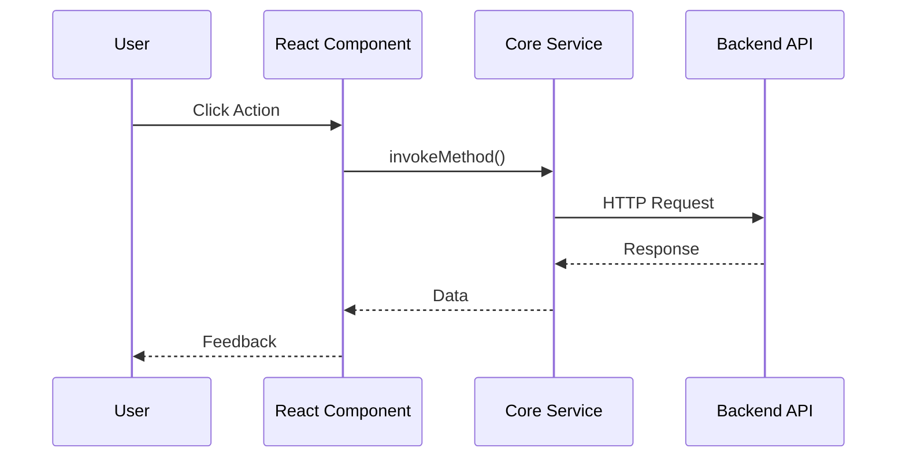

# UML Diagramming Standards

**Tool:** Mermaid.js

## Required Diagrams

### 1. Sequence Diagrams (API Flows)
Use for documenting the flow of data between UI, Core Services, and Backend APIs.

### 2. Class Diagrams (Core Logic)
Use for documenting complex business logic classes and interfaces in `packages/core`.

### 3. Entity-Relationship (Database)
Use for documenting Database Schemas (if applicable).
