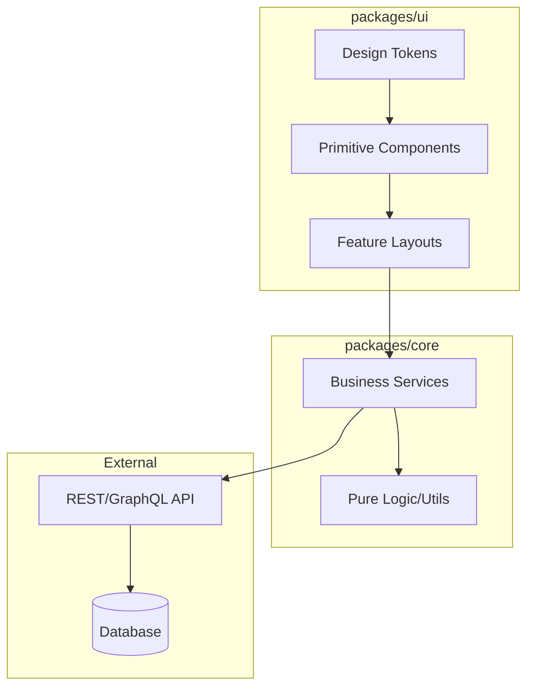

# Relations & Dependencies

## Architecture Map

## Boundaries
1.  **UI Layer:** NEVER communicates directly with the Database.
2.  **UI Layer:** SHOULD minimize direct API calls; prefer routing through Core Services.
3.  **Core Layer:** Should be UI-agnostic (no React imports if possible, plain TS/JS).
