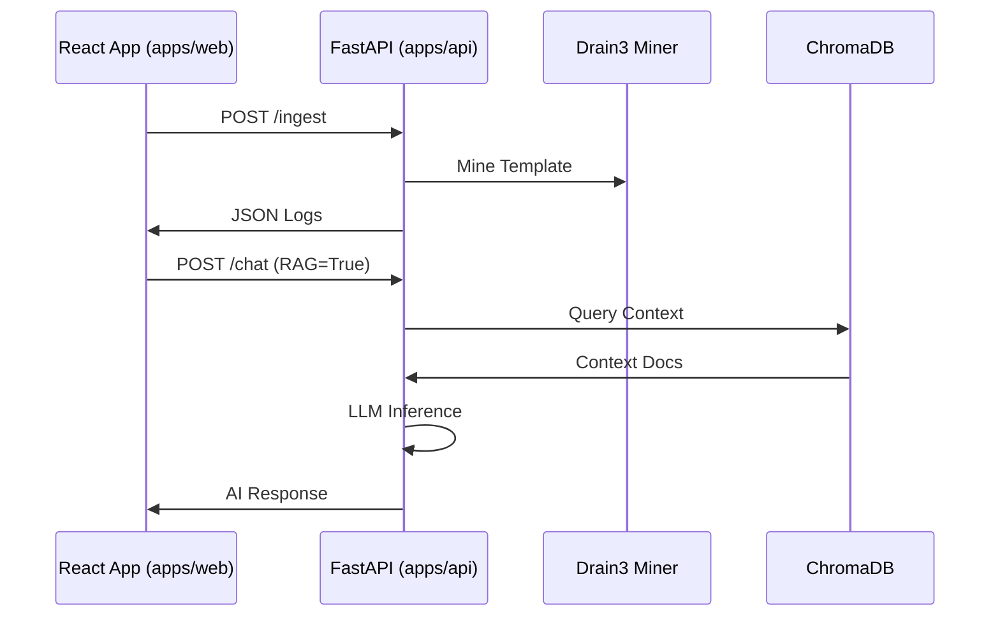

# Relations & Dependencies

## System Architecture

## Boundaries
1.  **Web:** Pure Consumer. No business logic regarding log parsing.
2.  **API:** The Brain. Owns Parsing, Mining, and AI.
3.  **Shared:** `packages/shared` defines the Interface (JSON contracts) between Web and API.
